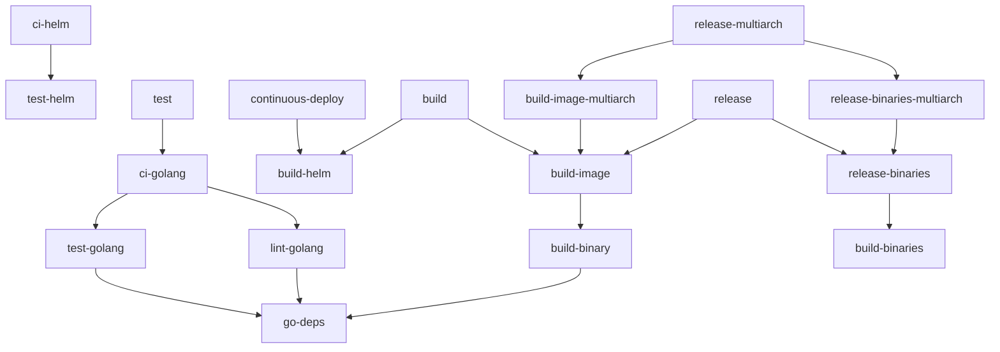

```mermaid
graph TD
  ci-helm --> test-helm
  test --> ci-golang
  test-golang --> go-deps
  lint-golang --> go-deps
  continuous-deploy --> build-helm
  build --> build-helm
  build --> build-image
  build-binary --> go-deps
  build-image --> build-binary
  ci-golang --> lint-golang
  ci-golang --> test-golang
  build-image-multiarch --> build-image
  release --> build-image
  release --> release-binaries
  release-multiarch --> release-binaries-multiarch
  release-binaries-multiarch --> release-binaries
  release-multiarch --> build-image-multiarch
  release-binaries --> build-binaries
```
